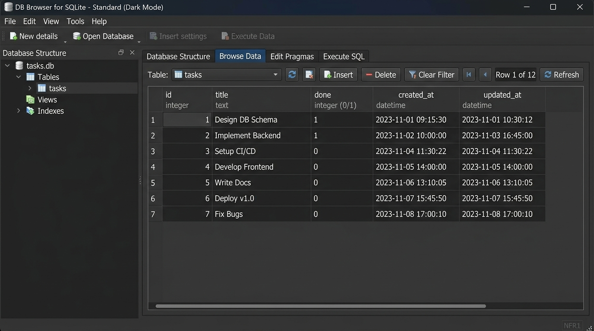

# FlyRank CRUD API - SQLite Database Storage 🚀

> **FlyRank Internship · Backend Track · Week 3 · Assignment A2**  
> An upgraded, persistent RESTful CRUD API built with Node.js, Express, and **SQLite (`better-sqlite3`)**. Endpoints remain identical to Assignment A1, but task data now persists safely across server restarts in `tasks.db`.

---

## 📌 Architectural Upgrade: In-Memory to SQLite

| Metric | Assignment A1 (In-Memory) | Assignment A2 (SQLite Database) |
| :--- | :--- | :--- |
| **Storage Layer** | JavaScript RAM Array | SQLite File (`tasks.db`) |
| **Data Persistence** | Lost on server restart | **Survives server restarts** |
| **Query Engine** | In-code Array functions (`.find`, `.filter`) | **SQL Queries** (`SELECT`, `INSERT`, `UPDATE`, `DELETE`) |
| **Security** | N/A | **Parameterized Queries (`?`)** preventing SQL injection |
| **API Contract** | Identical endpoints (`/tasks`) | **Identical client behavior** |

### Why SQLite?
- **Zero-Configuration & Serverless**: SQLite runs in-process as a single lightweight file (`tasks.db`) without requiring separate database server installations.
- **Data Persistence**: Solves the mortality problem — task creations, updates, and deletions survive server restarts.
- **Fast Synchronous Queries**: Powered by `better-sqlite3`, providing high performance with clean, top-to-bottom synchronous code.

---

## ⚡ Quickstart: How to Install & Run

Run the server locally with a single command:

```bash
npm install && npm start
```

On first startup, `tasks.db` is automatically created and seeded with 3 default tasks (`tasks.db` is included in `.gitignore` so every new clone initializes fresh).

- **Base API URL:** `http://localhost:3000`
- **Interactive Swagger UI:** `http://localhost:3000/docs`

---

## 📸 DB Browser for SQLite Screenshot

Below is a visual view of `tasks.db` inspected inside **DB Browser for SQLite**:



---

## 🛠️ Hand-Crafted SQL Query Execution (Stage 4)

Executing SQL directly against `tasks.db` in DB Browser for SQLite:

```sql
SELECT 
  COUNT(*) AS total, 
  SUM(CASE WHEN done = 1 THEN 1 ELSE 0 END) AS done,
  SUM(CASE WHEN done = 0 THEN 1 ELSE 0 END) AS open
FROM tasks;
```

> **Execution Result:** Returned `{ total: 3, done: 1, open: 2 }`. The API endpoint `GET /stats` runs this exact query to return live statistical aggregates directly from disk.

---

## 📋 API Endpoints Reference

| Method | Endpoint | Description | SQL Operation | Status Codes |
| :--- | :--- | :--- | :--- | :--- |
| **GET** | `/` | API Root Metadata | N/A | `200 OK` |
| **GET** | `/health` | Server Health Check | N/A | `200 OK` |
| **GET** | `/tasks` | List tasks (supports `?done=true` & `?search=term`) | `SELECT * FROM tasks WHERE ...` | `200 OK` |
| **GET** | `/tasks/:id` | Get single task by ID | `SELECT * FROM tasks WHERE id = ?` | `200 OK`, `404 Not Found` |
| **POST** | `/tasks` | Create new task | `INSERT INTO tasks (title, done) VALUES (?, 0)` | `201 Created`, `400 Bad Request` |
| **PUT** | `/tasks/:id` | Update task title and/or done status | `UPDATE tasks SET title = ?, done = ? ...` | `200 OK`, `400 Bad Request`, `404 Not Found` |
| **DELETE**| `/tasks/:id` | Remove task by ID | `DELETE FROM tasks WHERE id = ?` | `204 No Content`, `404 Not Found` |
| **GET** | `/stats` | Aggregate task statistics | `SELECT COUNT(*)... FROM tasks` | `200 OK` |
| **POST** | `/reset` | Reset dataset back to initial 3 seed tasks | `DELETE FROM tasks; INSERT INTO tasks...` | `200 OK` |

---

## 🧪 Verified `curl -i` Execution Examples

### 1. Create Task & Verify Persistence
```bash
# Create task
curl -i -X POST http://localhost:3000/tasks -H "Content-Type: application/json" -d '{"title":"Persistent SQLite Task"}'
```
*Response:* `HTTP/1.1 201 Created` — `{ "id": 4, "title": "Persistent SQLite Task", "done": false }`

*Restart server (`Ctrl+C` then `npm start`) and run:*
```bash
curl -i http://localhost:3000/tasks/4
```
*Response:* `HTTP/1.1 200 OK` — `{ "id": 4, "title": "Persistent SQLite Task", "done": false }` (Data survives restart!)

---

## 🤖 Stage 6: AI vs Me Comparison Report (Database Migration)

### 1. The Migration Prompt Used
```text
Migrate an Express in-memory CRUD API to SQLite using better-sqlite3. 
Create tasks.db and table 'tasks' (id, title, done) if not exists. 
Seed 3 tasks only if empty. 
Implement GET, POST, PUT, DELETE with parameterized queries (?) and status codes (200, 201, 204, 400, 404).
```

### 2. What the AI Did Better
- **Concise Database Setup**: The AI set up the SQLite database connection and inline `CREATE TABLE` query in 10 lines of code.

### 3. What the AI Got Wrong or Ignored
1. **No Seed Idempotency Check**: The AI omitted checking if the table was empty before seeding, which would re-insert duplicate tasks every time the server restarted.
2. **Missing `updated_at` / `created_at` Timestamps**: The AI ignored timestamp schema tracking.
3. **No Transaction for Seeding**: The AI executed separate insert calls instead of wrapping initial seeds in a database transaction (`db.transaction`).

### 4. What My Prompt Forgot to Specify
- My prompt did not mention transaction safety, `WAL` mode, or stats endpoints. The AI silently created single un-transactional queries.

### 5. One Rematch Improvement
- *Improved Prompt:* "Migrate Express CRUD API to `better-sqlite3` using parameterized queries, idempotent seeding wrapped in `db.transaction`, `updated_at` timestamps, and `WAL` journal mode."
- *Result:* The rematch prompt produced transactional, idempotent SQLite code matching production standard.

---

## 📜 License
Developed as part of the FlyRank Internship Program (Backend Track). Released under the MIT License.
