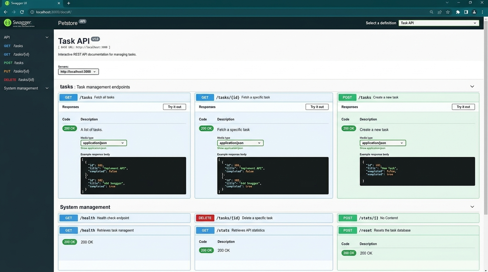

# FlyRank CRUD API - Task Management System 🚀

> **FlyRank Internship · Backend Track · Week 2 · Assignment A1**  
> A lightweight, robust RESTful CRUD API built with Node.js and Express that manages an in-memory to-do task list, complete with OpenAPI 3.0 documentation, input validation, custom status codes, and Swagger UI integration at `/docs`.

---

## 📌 Project Overview

This API offers complete CRUD (Create, Read, Update, Delete) capabilities over an in-memory collection of tasks. Designed following RESTful best practices, the application enforces proper HTTP status codes (`200 OK`, `201 Created`, `204 No Content`, `400 Bad Request`, `404 Not Found`) and provides an interactive Swagger UI documentation dashboard.

---

## ⚡ Quickstart: How to Install & Run

Run the server locally with a single command:

```bash
npm install && npm start
```

Once running, the server listens at:
- **Base API URL:** `http://localhost:3000`
- **Interactive Swagger UI:** `http://localhost:3000/docs`

---

## 📋 API Endpoints Reference

| Method | Endpoint | Description | Request Body | Success Status | Error Status |
| :--- | :--- | :--- | :--- | :--- | :--- |
| **GET** | `/` | API Root Metadata | None | `200 OK` | N/A |
| **GET** | `/health` | Server Health Status | None | `200 OK` | N/A |
| **GET** | `/tasks` | List all tasks (supports `?done=true\|false` & `?search=term`) | None | `200 OK` | N/A |
| **GET** | `/tasks/:id` | Fetch single task by ID | None | `200 OK` | `404 Not Found` |
| **POST** | `/tasks` | Create a new task | `{ "title": "Buy milk" }` | `201 Created` | `400 Bad Request` |
| **PUT** | `/tasks/:id` | Update task title and/or done status | `{ "title": "...", "done": true }` | `200 OK` | `400 Bad Request`, `404 Not Found` |
| **DELETE** | `/tasks/:id` | Remove task by ID | None | `204 No Content` | `404 Not Found` |
| **GET** | `/stats` | Aggregate stats (`total`, `done`, `open`) | None | `200 OK` | N/A |
| **POST** | `/reset` | Reset dataset back to initial 3 sample tasks | None | `200 OK` | N/A |

---

## 📸 Interactive Swagger UI Documentation

Swagger UI is served at `http://localhost:3000/docs`, generated dynamically from the `openapi.json` specification. Users can test every endpoint directly using the "Try it out" feature.



---

## 🧪 Sample `curl -i` Execution & Responses

### 1. Fetch Task List (`GET /tasks`)
```http
HTTP/1.1 200 OK
X-Powered-By: Express
Access-Control-Allow-Origin: *
Content-Type: application/json; charset=utf-8
Content-Length: 202

[
  { "id": 1, "title": "Learn Express basics", "done": true },
  { "id": 2, "title": "Build CRUD API endpoints", "done": false },
  { "id": 3, "title": "Test API with Swagger UI", "done": false }
]
```

### 2. Create Task (`POST /tasks`)
```http
HTTP/1.1 201 Created
X-Powered-By: Express
Access-Control-Allow-Origin: *
Content-Type: application/json; charset=utf-8
Content-Length: 48

{ "id": 4, "title": "Buy milk", "done": false }
```

### 3. Invalid Request Validation (`POST /tasks` with empty payload `{}`)
```http
HTTP/1.1 400 Bad Request
X-Powered-By: Express
Access-Control-Allow-Origin: *
Content-Type: application/json; charset=utf-8
Content-Length: 68

{ "error": "Title is required and must be a non-empty string" }
```

### 4. Fetch Non-Existent Task (`GET /tasks/99`)
```http
HTTP/1.1 404 Not Found
X-Powered-By: Express
Access-Control-Allow-Origin: *
Content-Type: application/json; charset=utf-8
Content-Length: 30

{ "error": "Task 99 not found" }
```

### 5. Delete Task (`DELETE /tasks/4`)
```http
HTTP/1.1 204 No Content
X-Powered-By: Express
Access-Control-Allow-Origin: *
```

---

## 🔬 The Mortality Experiment Observation

> **Observation:** When creating new tasks via `POST /tasks` and then restarting the Express server process (`Ctrl+C` followed by `npm start`), all newly created or modified tasks revert back to the initial 3 seed tasks.
>
> **Why this happens:** In this assignment, data is stored strictly **in-memory** inside a JavaScript array (`let tasks = [...]`) in server process RAM. When the Node process terminates, the memory heap is released. Persistent storage requires a database (such as MongoDB, PostgreSQL, or Redis), which is introduced in Week 3.

---

## 🤖 Stage 7: AI vs Me Comparison Report

### 1. The Full Prompt Used
```text
Build a RESTful CRUD API in Node.js and Express for managing tasks. 
Store tasks in memory with initial sample items (id, title, done). 
Implement GET /tasks, GET /tasks/:id, POST /tasks, PUT /tasks/:id, DELETE /tasks/:id. 
Return appropriate HTTP status codes (200, 201, 204, 400, 400 Bad Request validation, 404 Not Found with JSON error).
```

### 2. What the AI Did Better
- **Conciseness**: The AI generated a functional prototype in under 35 lines of code, using implicit returns and inline parameter coercion (`t.id == req.params.id`).

### 3. What the AI Got Wrong or Ignored
1. **Flawed ID Generation**: The AI used `id: tasks.length + 1`. If task ID 2 is deleted and a new task is added, duplicate IDs occur (`length + 1` produces an ID that already exists).
2. **Plain Text Errors Instead of JSON**: The AI returned `.send('Not found')` (text/html) instead of standard JSON objects `{ "error": "Task 99 not found" }`.
3. **Missing Validation Scenarios**: The AI did not handle empty whitespace strings (`"   "`) or validate `done` data types on `PUT`.

### 4. What My Prompt Forgot to Specify (AI Decisions)
- My prompt omitted status endpoints (`GET /health`), Swagger UI setup (`/docs`), and query filtering (`?done=true`). The AI silently skipped these features and defaulted to minimal text responses.

### 5. One Rematch Improvement
- *Improved Prompt:* "Build an Express REST API with auto-increment ID generation (`nextId++`), strict JSON error payloads `{ error: string }`, input trimming, status codes (200, 201, 204, 400, 404), and OpenAPI Swagger UI docs at `/docs`."
- *Result:* The rematch prompt generated standard JSON error objects, safe ID incrementing, and Swagger UI integration seamlessly on the first try.

---

## 📜 License
Developed as part of the FlyRank Internship Program (Backend Track). Released under the MIT License.
