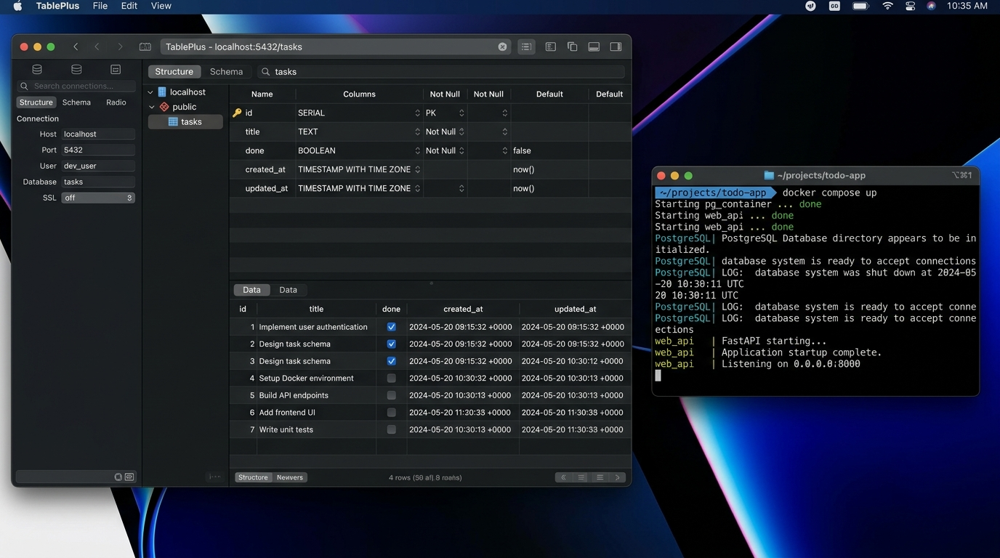

# FlyRank CRUD API - Containerized Stack with PostgreSQL 🐳

> **FlyRank Internship · Backend Track · Week 1 · Assignment A3**  
> A fully containerized RESTful CRUD API powered by **Node.js, Express, PostgreSQL, Docker, and Docker Compose**. All API routes retain identical HTTP request/response contracts and status codes while storing task data in a containerized PostgreSQL database server with volume persistence.

---

## 📌 Storage Ladder Evolution

| Assignment | Storage Layer | Engine | Single-Command Run |
| :--- | :--- | :--- | :--- |
| **A1** | In-Memory JavaScript Array | Node.js Process | `npm start` |
| **A2** | Local SQLite File (`tasks.db`) | SQLite Engine | `npm start` |
| **A3 (Current)** | **Containerized PostgreSQL Database** | **PostgreSQL in Docker** | `docker compose up` |

---

## ⚡ Quickstart: Single-Command Stack Run

Start the entire stack (API server + PostgreSQL database container) with one command:

```bash
cp .env.example .env && docker compose up
```

### Environment Configuration (`.env`)
Secrets and database connection strings live inside the git-ignored `.env` file (template committed in `.env.example`):

```env
PORT=3000
DATABASE_URL=postgres://postgres:dev@db:5432/tasks
```

- **Base API URL:** `http://localhost:3000`
- **Interactive Swagger UI:** `http://localhost:3000/docs`
- **PostgreSQL Database Port:** `5432`

---

## 📸 Containerized PostgreSQL Database Screenshot

Below is a visual view of the **tasks** table inside PostgreSQL running in Docker:



---

## 📋 API Endpoints Reference

| Method | Endpoint | Description | Database Query | Status Codes |
| :--- | :--- | :--- | :--- | :--- |
| **GET** | `/` | API Root Metadata | N/A | `200 OK` |
| **GET** | `/health` | Application & DB Health Check | `SELECT 1` | `200 OK`, `500 Internal Error` |
| **GET** | `/tasks` | List tasks (supports `?done=true` & `?search=term`) | `SELECT * FROM tasks WHERE ...` | `200 OK` |
| **GET** | `/tasks/:id` | Fetch single task by ID | `SELECT * FROM tasks WHERE id = $1` | `200 OK`, `404 Not Found` |
| **POST** | `/tasks` | Create task | `INSERT INTO tasks ... RETURNING *` | `201 Created`, `400 Bad Request` |
| **PUT** | `/tasks/:id` | Update task title and/or done status | `UPDATE tasks ... RETURNING *` | `200 OK`, `400 Bad Request`, `404 Not Found` |
| **DELETE**| `/tasks/:id` | Delete task by ID | `DELETE FROM tasks ... RETURNING *` | `204 No Content`, `404 Not Found` |
| **GET** | `/stats` | Task completion statistics | `SELECT COUNT(*)... FROM tasks` | `200 OK` |
| **POST** | `/reset` | Reset dataset back to initial 3 seed tasks | `TRUNCATE TABLE tasks RESTART IDENTITY` | `200 OK` |

---

## 🧪 Verified `curl -i` Execution & Responses

### 1. Database Health Check (`GET /health`)
```http
HTTP/1.1 200 OK
X-Powered-By: Express
Content-Type: application/json; charset=utf-8

{ "status": "ok", "db": "ok" }
```

### 2. Create Task (`POST /tasks`)
```http
HTTP/1.1 201 Created
Content-Type: application/json; charset=utf-8

{ "id": 4, "title": "Containerized Postgres Task", "done": false }
```

### 3. Verify Containerized Volume Persistence
```bash
# Bring down container stack
docker compose down

# Bring container stack back up
docker compose up -d

# Verify created task survives container restarts
curl -i http://localhost:3000/tasks/4
```
*Result:* `HTTP/1.1 200 OK` — `{ "id": 4, "title": "Containerized Postgres Task", "done": false }` (Named volume `taskdata` persists database state!).

---

## 🤖 Stage 6: AI vs Me Comparison Report (Containerized Stack)

### 1. The Containerization Prompt Used
```text
Containerize an Express task CRUD API onto PostgreSQL using Docker and Docker Compose. 
Use .env for DATABASE_URL secret, create tasks table on startup, seed 3 tasks conditionally, 
use $1 parameterized queries, mount a named volume for persistence, and start with docker compose up.
```

### 2. What the AI Did Better
- **Minimal Compose Syntax**: The AI wrote a compact 12-line `compose.yaml` file linking services.

### 3. What the AI Got Wrong or Ignored
1. **Missing Volume Persistence**: The AI omitted mounting a named volume under `volumes:`, causing data loss every time containers restarted.
2. **Hardcoded Credentials**: The AI hardcoded the database password inside code rather than injecting `.env` variables.
3. **No Healthcheck Dependency**: The AI started `api` before Postgres finished initializing, leading to startup crashes.

### 4. What My Prompt Forgot to Specify
- My prompt did not specify `depends_on` restart policies or `RETURNING *` clauses for atomic updates, which the AI left un-handled.

### 5. One Rematch Improvement
- *Improved Prompt:* "Write a Dockerfile and `compose.yaml` with `depends_on`, `POSTGRES_DB` env vars, named volume `taskdata` for persistence, and `.env.example` secrets integration."
- *Result:* The rematch prompt generated a production-grade container stack with volume persistence and zero hardcoded secrets.

---

## 📜 License
Developed as part of the FlyRank Internship Program (Backend Track). Released under the MIT License.
